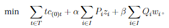
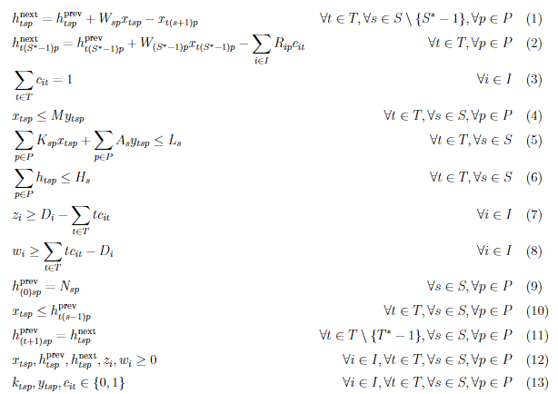

# 最佳化模型

如前所述，生產鋁門窗的各個流程拆分為前置作業及廠內作業兩個部分。前置作業由上田鋁業委託合作廠商完成，主要考慮訂貨量與訂貨時間，理論上無產能上限；反之，廠內作業的生產流程受限於加工機數量、技術人員數量等，具有最大產能上限，是工廠產出的主要瓶頸。因此，我們利用作業研究模型和啟發性演算法規劃出廠內最佳生產規劃，並推算出前置處理所需的時間，求得鋁門窗生產的最佳解。

本模型適用於兩個場景：其一，用於估計最新製造需求單的所需時間；其二，用於應對突發事件導致生產環境變動，快速估算製造需求單的完成時間。透過將門窗生產規劃問題轉換為整數線性規劃問題，我們使用自動化最佳化工具來求解最早交貨期限及最佳化的生產規劃。

### 索引

- $i$：待完成的製造需求單編號，共 $I^*$ 筆。
- $t$：時段編號，單位為天，共 $T^*$ 時段。
- $s$：工作站編號，共 $S^*$ 個工作站，包含 $45^{\circ}$裁切、$90^{\circ}$裁切、油壓式沖孔、空壓式沖孔、裝配、組立和包裝。
- $p$：產品編號，共 $P^*$ 種不同產品。

### 參數

- $W_{sp}$：轉換率，在生產產品 $p$ 時，階段 $s$ 投入 1 單位原料或在製品後，會產出 $W_{sp}$ 單位的在製品或完成品。
- $L_{s}$：工作站產能上限，階段 $s$ 的工作站在一個時段內最多能投入的產能。
- $K_{sp}$：單位投入產能，階段 $s$ 處理產品 $p$ 時，把 1 單位的投入量處理好需花費的產能。
- $D_i$：截止時段，製造需求單 $i$ 需在時段 $D_i$ 前完成。
- $R_{ip}$：製造需求單需求量，製造需求單 $i$ 需要的產品 $p$ 的數量。
- $H_{s}$：在製品存量上限，階段 $s$ 的在製品存量最大值。
- $P_{i}$：提早交貨的懲罰，製造需求單 $i$ 每提早一個時段的懲罰單位。
- $Q_{i}$：延遲交貨的懲罰，製造需求單 $i$ 每延遲一個時段的懲罰單位。
- $A_{s}$：生產啟動成本，階段 $s$ 每增加一種產品所增加的成本。
- $N_{sp}$：各階段的初始存貨量，模型開始時的產品 $p$ 在階段 $s$ 的初始數量。
- $M$：數字上界，確保模型中的決策變數能正確被最佳化。
- $\alpha$：提早交貨懲罰的權重參數，值越高代表模型更注重減少提早交貨。
- $\beta$：延遲交貨懲罰的權重參數，值越高代表模型更注重減少延遲交貨。

### 決策變數

- $x_{tsp}$：投入量，代表時段 $t$ 內階段 $s$ 生產產品 $p$ 的投入量。
- $h^{\text{prev}}_{tsp}$：在製品存貨量，時段 $t$ 開始時階段 $s$ 的產品 $p$ 的在製品存貨量。
- $h^{\text{next}}_{tsp}$：時段 $t$ 結束時的存貨量，這些存貨將被投入下一階段。
- $y_{tsp}$：工作站是否被分配到產品 $p$，為二元變數，$1$ 代表在時段 $t$ 階段 $s$ 的產品 $p$ 有生產，$0$ 代表無生產。
- $c_{it}$：是否交貨製造需求單 $i$，為二元變數，$1$ 代表交貨，$0$ 代表未交貨。
- $z_i$：製造需求單 $i$ 提早交貨的時段數。
- $w_i$：製造需求單 $i$ 延遲交貨的時段數。

### 目標函數
以下是本模型的目標函數：

由於 $c_{0t}$ 決定最新製造需求單的交貨時段，乘以變數 $t$ 後加總就會是最終製造需求單交貨的時段，意即最新製造需求單的交貨時段。我們的目標就是盡可能最小化 $\sum_{t \in T} tc_{0t}$。而由於建設案太早交貨的話會有懲罰，因此我們也要最小化每個建設案件提早交貨的時段與截止時段之間的差距。建設案和經銷案延遲交貨的話都會有懲罰，我們也要最小化每個案件延遲交貨的時段與截止時段的差距。兩種懲罰分別會用參數 $\alpha$和$\beta$ 來調整懲罰佔目標式的比例。

### 限制式
以下是本模型的限制式：

- 限制式 (1) 表示每期的投入量、產出量、與在製品存貨量的平衡。
- 限制式 (2) 表示最終產物的存貨量與交貨量的平衡。
- 限制式 (3) 表示每張製造需求單有且僅有一個交貨時段。
- 限制式 (4) 表示每期工作站的運行與生產的關聯。
- 限制式 (5) 表示每期生產總產能消耗不得超過產能上限。
- 限制式 (6) 表示每期在製品存貨量不得超過存量上限。
- 限制式 (7) 表示提早交貨的時段數。
- 限制式 (8) 表示延遲交貨的時段數。
- 限制式 (9) 表示初始的在製品存貨量。
- 限制式 (10) 表示生產投入量不得超過在製品存貨量。
- 限制式 (11) 表示每期的在製品存貨量平衡。
- 限制式 (12) 表示變數非負性。
- 限制式 (13) 表示二元變數的定義。