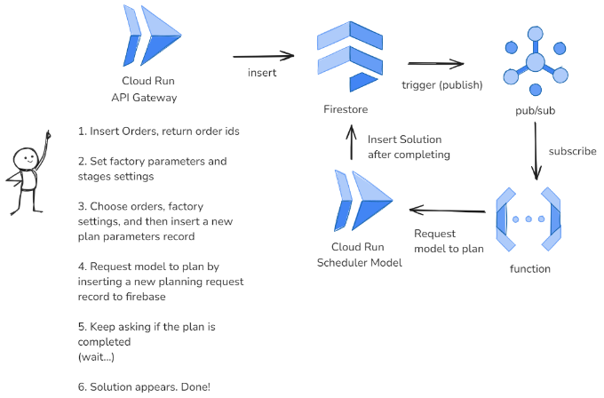

# 概觀

系統架構圖與使用情境如下：

本系統使用微服務架構，每個服務都是獨立的，並且可以獨立部署。這樣的架構有助於系統的擴展性和可靠性。生產規劃系統使用 Google Cloud 平台來實現，主要包括以下幾個部分：

1. **Cloud Run API Gateway**：
   - 使用者首先通過 Cloud Run 部署的 API Gateway 來插入訂單、環境參數等，API Gateway 接收到訂單後，會返回訂單的 ID。
   - 這是系統的入口，允許用戶提交他們的生產規劃請求，其中包含讀取和新增訂單的生產參數和工廠參數等。
   - 使用上，用戶會先新增一些需要被生產規劃的訂單，然後在寫入工廠參數，最後選擇相應訂單和工廠參數生成一個最佳生產規劃模型參數，最後再向系統發送排程請求。

2. **Firestore**：
   - 訂單和工廠參數被插入到 Firestore（Google Cloud 的 NoSQL 資料庫）中。
   - Firestore 同時觸發一個 Pub/Sub 事件，通知後續系統有新的資料可以進行處理。

3. **Pub/Sub（Publish/Subscribe）**：
   - Firestore 觸發 Pub/Sub（發布/訂閱系統），將訊息發布給訂閱者。
   - 在這裡，Pub/Sub 的作用是負責消息的傳遞，通知有新訂單需要進行處理。

4. **Cloud Function**：
   - Pub/Sub 的訂閱者是部署在 Cloud Functions 上的一個函數。
   - Cloud Function 收到通知後，會向 Cloud Run 的 Scheduler Model 發送請求，要求進行排程模型的計算。

5. **Cloud Run Scheduler Model**：
   - 這是一個部署在 Cloud Run 上的排程模型，用於根據收到的訂單和生產參數進行排程計算。
   - Cloud Function 會請求 Scheduler Model 根據特定的訂單和工廠參數來生成最佳生產規劃方案。

6. **解決方案插入 Firestore**：
   - 當 Cloud Run Scheduler Model 完成計算後，解決方案會被插入回 Firestore 中。
   - 用戶可以不斷輪詢（詢問） Firestore，檢查解決方案是否已經生成。

7. **最終結果**：
   - 當解決方案完成後，用戶可以在 Firestore 中看到結果，整個流程到此結束。

以上就是整個生產規劃系統的概觀，接下來我們將逐一介紹每個部分的細節。